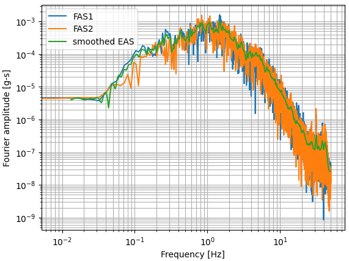

# eas

eas computes the smoothed effective amplitude spectrum from the Fourier amplitude spectrum of two orthogonal horizontal ground motions. The steps are:

1. compute the Fourier transform of both input motions
2. compute the effective amplitude spectrum defined as $eas = \sqrt{fas1^2 + fas2^2}$
3. smooth the effective amplitude spectrum using the smoothing algorithm by Konno and Ohmachi (1998) [pdf](http://www.eq.db.shibaura-it.ac.jp/papers/Konno&Ohmachi1998.pdf).


## Installation  
```python
pip install ucla_geotech_tools
```

## Functions
```python
smoothed_fas(fas, f, fc, b, w)
get_smooth_eas(acc1, acc2, dt, b, w)
```

### smoothed_fas(fas, f, fc, b, w) 
fas = Fourier amplitude spectrum. Real-valued numpy array.
f = Frequency array. Real-valued numpy array.
fc = Frequency values for smoothed Fourier spectrum. Real-valued numpy array.
b = Konno-Omachi smoothing parameter. Real-valued scalar.
w = Konno-Omachi bandwidth parameter. Real-valued scalar.
fac_c = Smoothed Fourier amplitude spectrum. Real-valued numpy array.

Returns numpy array containing smoothed Fourier amplitude spectrum

### get_smooth_eas(acc1, acc2, dt, b, w)

acc1, acc2 = acceleration time series. Real-valued numpy arrays.
dt = time step in seconds. Real-valued.
b = Konno-Omachi smoothing parameter. Real-valued scalar.
w = Konno-Omachi bandwidth parameter. Real-valued scalar.
fc = Frequency values for smoothed spectrum. Real-valued numpy array.
eas = effective amplitude spectrum. Real-valued numpy array.

Returns numpy array containing natural smoothed effective amplitude spectrum and associated frequencies.

## Notes
1. Frequencies for smoothed eas are pre-defined in the get_smooth_eas function to standardize the spectra.
2. The Numpy fft.rfft package is used to compute the Fourier spectra. The default option is used, which does not perform any scaling in the FFT and scales the IFFT by 1/N. The Fourier coefficients are multiplied by the time step, $dt$, such that the units of the Fourier amplitude spectrum are [g-s], assuming the input motion has units of g.
3. The number of points in the FFT, $N_{FFT}$ has an influence on the Fourier amplitude spectrum ordinates because earthquake ground motion signals are non-stationary. We generally pad with zeros to make the FFT algorithm more efficient. Padding with zeros increases the number of frequency steps in the Fourier transform, but does not increase the energy in teh signal. Therefore, the Fourier amplitude decreases as length of the zeropad increases. The number of points used in the Fourier amplitude spectrum depends on the time step according to the table below.

| $dt$ [s] | $N_{FFT}$ |
| ------ | -------- |
| 0.005  | $2^{19}$ |
| 0.010  | $2^{18}$ |
| 0.020  | $2^{17}$ |
| 0.025  | $2^{17}$ |
| 0.050  | $2^{16}$ |
| 0.100  | $2^{15}$ |

### Example Commands

An example is shown below using the two ground motion records that can be found in the tests directory of this repository.

```python
import numpy as np
import pandas as pd
import matplotlib.pyplot as plt
import eas

acc1 = pd.read_csv('20210102144223_BK_BDM_HHE.txt',sep=' ')['acc(g)'].values
acc2 = pd.read_csv('20210102144223_BK_BDM_HHN.txt',sep=' ')['acc(g)'].values
dt = 0.01
b = 188.5
w = 1.0/(10.0**(3.0/b))

facc1 = np.fft.rfft(acc1)*dt
facc2 = np.fft.rfft(acc2)*dt
fc, eas_vec = eas.get_smooth_eas(acc1, acc2, dt, b, w)
freq = np.fft.rfftfreq(len(acc1), d=dt)

fig, ax = plt.subplots()
ax.plot(freq, np.abs(facc1), label='FAS1')
ax.plot(freq, np.abs(facc2), label='FAS2')
ax.plot(fc, eas_vec, label='smoothed EAS')
ax.set_xscale('log')
ax.set_yscale('log')
ax.grid(True, which='both')
ax.set_xlabel('Frequency [Hz]')
ax.set_ylabel('Fourier amplitude [g-s]')
ax.legend()
```

