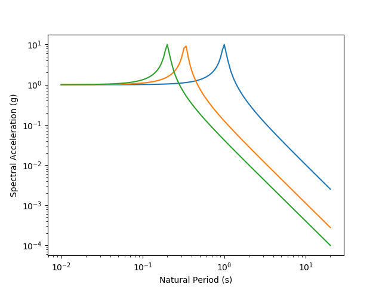

# response_spectrum

response_spectrum computes a psuedo-acceleration response spectrum from an input ground motion or set of ground motions sampled at a constant frequency. Calculates are performed in the frequency domain by

1. taking the Fourier transform of the input motion(s)
2. multiplying by the transfer function for computing the motion of a single-degree-of-freedom (SDOF) oscillator with natural period T and damping D
3. computing the peak acceleration amplitude for the SDOF oscillator
4. repeating steps 2 and 3 for a range of user-specified periods

## Installation  
```bash
pip install ucla_geotech_tools.response_spectrum
```

## Command
```bash
get_response_spectrum(**kwargs)
get_ngawest2_T()
```

## Input parameters.
```
motion(s) = an M x N list or python array containing acceleration data, where M is the number of motions and N is the number of data points in each motion. All motions must have the same number of data points. (required)  
dt = time step (required)
D = damping (optional, default = 0.05)
T = array of natural periods (optional, default = array used for NGAwest2 project: 
T = [0.01, 0.02, 0.022, 0.025, 0.029, 0.030, 0.035, 0.036, 0.040, 0.042, 0.044, 0.045, 0.046, 0.048, 0.050, 0.055, 0.060, 0.065, 0.067, 0.070, 0.075, 0.080, 0.085, 0.090, 0.095, 0.100, 0.11, 0.12, 0.13, 0.14, 0.15, 0.16, 0.17, 0.18, 0.19, 0.20, 0.22, 0.24, 0.25, 0.26, 0.28, 0.29, 0.30, 0.32, 0.34, 0.35, 0.36, 0.38, 0.40, 0.42, 0.44, 0.45, 0.46, 0.48, 0.50, 0.55, 0.60, 0.65, 0.70, 0.75, 0.80, 0.85, 0.90, 0.95, 1.0, 1.1, 1.2, 1.3, 1.4, 1.5, 1.6, 1.7, 1.8, 1.9, 2.0, 2.2, 2.4, 2.5, 2.6, 2.8, 3.0, 3.2, 3.4, 3.5, 3.6, 3.8, 4.0, 4.4, 4.6, 4.8, 5.0, 5.5, 6.0, 6.5, 7.0, 7.5, 8.0, 8.5, 9.0, 9.5, 10.0, 11.0, 12.0, 13.0, 14.0, 15.0, 20.0])
zeropad = 1: apply zero padding to speed up FFT operation, 0: do not pad with zeros (optional, default = 1)
verbose = 1: print output message when default values are being used, 0: suppress output messages (optional, default = 1)
```

## Python script
```python
import numpy as np
import ucla_geotech_tools.response_spectrum as ars
import matplotlib.pyplot as plt

N = 4000               # Number of time steps
M = 3                  # Number of motions
dt = 0.005             # Time step in seconds
D = 0.05               # Damping
freq = [1.0, 3.0, 5.0] # Frequencies for three different harmonic motions

motions = np.empty([M,N],dtype="float64")
for i in range(M):
    for j in range(N):
        motions[i][j] = np.sin(2*np.pi*freq[i]*j*dt)

# Get spectral periods used in NGAWest2 project
T = ars.get_ngawest2_T()

# Get Python array containing pseudo-spectral acceleration values
Sa = ars.get_response_spectrum(motions=motions, dt=dt, D=D, zeropad=0, verbose=0)

for i in range(M):
    plt.loglog(T,Sa[i])
plt.xlabel('Natural Period (s)')
plt.ylabel('Spectral Acceleration (g)')
```

## Output


## Example
The Jupyter notebook example illustrates how to use the response_spectrum package. The example creates three ground motions with amplitude of 1g, and frequencies of 1.0, 3.0, and 5.0 Hz, computes and plots their response spectra. Note that the sampling frequency and number of points have been selected to prevent spectral leakage (i.e., the signals are all periodic). Padding with zeros, or selecting a duration / sampling frequency combination that does not permit an integer number of cycles will result in spurious frequencies being present in the signal. Right click the link and use "Save link as".

[response_spectrum.ipynb](https://github.com/sjbrandenberg/ucla_geotech_tools/raw/main/response_spectrum/response_spectrum.ipynb)

